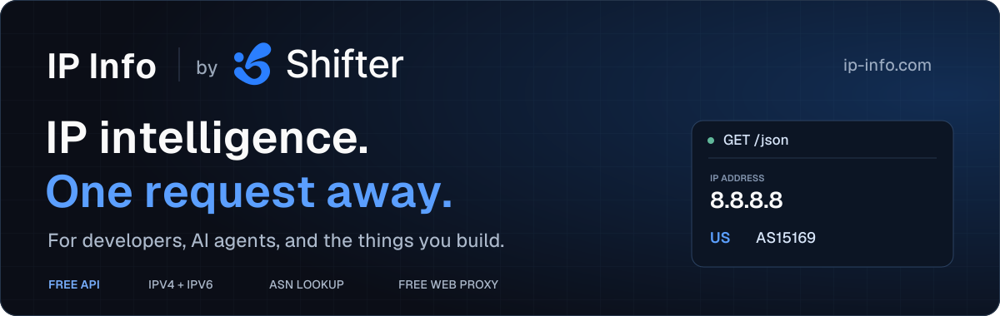

<p align="center">
  <a href="https://ip-info.com/?utm_source=github&amp;utm_medium=referral&amp;utm_campaign=ip_info&amp;utm_content=readme_header">
    
  </a>
</p>

<h1 align="center">Free IP Geolocation &amp; ASN API</h1>

<p align="center">
  Know your IP. Check your network. Build with confidence.<br>
  <strong>No signup. No API key. IPv4 and IPv6. Open-source Rust service.</strong>
</p>

<p align="center">
  <a href="https://ip-info.com/?utm_source=github&amp;utm_medium=referral&amp;utm_campaign=ip_info&amp;utm_content=readme_nav_lookup">IP Lookup</a> ·
  <a href="https://ip-info.com/docs?utm_source=github&amp;utm_medium=referral&amp;utm_campaign=ip_info&amp;utm_content=readme_nav_docs">API Docs</a> ·
  <a href="https://ip-info.com/ai?utm_source=github&amp;utm_medium=referral&amp;utm_campaign=ip_info&amp;utm_content=readme_nav_ai">AI Agents</a> ·
  <a href="https://ip-info.com/web-proxy?utm_source=github&amp;utm_medium=referral&amp;utm_campaign=ip_info&amp;utm_content=readme_nav_proxy">Free Web Proxy</a> ·
  <a href="https://shifter.io/?utm_source=github&amp;utm_medium=referral&amp;utm_campaign=ip_info&amp;utm_content=readme_nav_shifter">Shifter</a>
</p>

**IP Info** is a free IP address lookup and geolocation API maintained by [Shifter](https://shifter.io/?utm_source=github&utm_medium=referral&utm_campaign=ip_info&utm_content=readme_intro). Get the public IP, country, city, timezone, ISP, organization, and autonomous system number (ASN) behind a connection with a single HTTP request. Use it in your browser at [ip-info.com](https://ip-info.com/?utm_source=github&utm_medium=referral&utm_campaign=ip_info&utm_content=readme_intro), from the command line, or as a tool in an AI agent workflow.

This repository contains the Rust API service and IP Info website, including the interface for our [Free Web Proxy](https://ip-info.com/web-proxy?utm_source=github&utm_medium=referral&utm_campaign=ip_info&utm_content=readme_intro_proxy).

```sh
curl https://ip-info.com/json
```

## Contents

- [Why IP Info?](#why-ip-info)
- [API quickstart](#api-quickstart)
- [Built for AI agents](#built-for-ai-agents)
- [Check proxy exit IPs](#check-proxy-exit-ips)
- [Free Web Proxy](#free-web-proxy)
- [About Shifter and its products](#about-shifter-and-its-products)
- [Self-hosting](#self-hosting)
- [Development](#development)
- [FAQ](#faq)
- [Contributing and support](#contributing-and-support)
- [License](#license)

## Why IP Info?

A request succeeds, but it comes from the wrong country. A scraper uses a proxy, but you need to confirm its exit IP. An agent runs in the cloud, and you need to know which network it actually reaches the internet from.

IP Info makes those checks straightforward: send a request, get structured IP intelligence, and use it in your next decision. There is no account setup or secret to manage before your first lookup.

| Capability | What it helps you do |
| --- | --- |
| **IP geolocation** | Look up country, region, city, coordinates, and timezone for a public IPv4 or IPv6 address. |
| **ASN and ISP lookup** | Understand the network, provider, and organization associated with an IP. |
| **Public IP detection** | Check your connection with `/json`, or get only the IP as plain text with `/myip`. |
| **Proxy verification** | Compare the observed exit IP and country with the location your workflow expects. |
| **Predictable JSON** | Read 29 consistently present fields, with `null` for unavailable values. |
| **Agent-readable documentation** | Integrate using OpenAPI 3.1, `llms.txt`, and a complete plain-text reference. |
| **Browser-friendly API** | Call the API from frontend JavaScript with public GET CORS support. |
| **Inspectable implementation** | Run an MIT-licensed Rust service with a shared, memory-mapped IP database. |

The hosted API is free, including for automated and commercial application lookups, under the [service terms](https://ip-info.com/terms?utm_source=github&utm_medium=referral&utm_campaign=ip_info&utm_content=readme_terms). There is no application quota; shared capacity and acceptable-use protections still apply.

## API quickstart

### Look up an IP address

```sh
# Your public IP with geolocation and network data
curl --fail --max-time 15 https://ip-info.com/json

# Only your public IP, as plain text
curl --fail --max-time 15 https://ip-info.com/myip

# A specific IPv4 address
curl --fail --max-time 15 'https://ip-info.com/json?ip=8.8.8.8'

# A specific IPv6 address
curl --fail --max-time 15 'https://ip-info.com/json?ip=2001:4860:4860::8888'

# Equivalent path-based lookup
curl --fail --max-time 15 https://ip-info.com/8.8.8.8/json
```

### Example response

An abbreviated, illustrative response; live values may differ:

```json
{
  "ip": "8.8.8.8",
  "city": "Mountain View",
  "region": "California",
  "country": "US",
  "country_name": "United States",
  "timezone": "America/Los_Angeles",
  "asn": 15169,
  "as_name": "Google LLC",
  "isp": "Google LLC",
  "is_anycast": true
}
```

The full response includes 29 fields covering location, geographic identifiers, network information, and database classifications. See the [complete example](tests/example.json) and [field reference](https://ip-info.com/docs?utm_source=github&utm_medium=referral&utm_campaign=ip_info&utm_content=readme_fields#fields).

### JavaScript

Works in modern browsers and Node.js with built-in `fetch`:

```js
const response = await fetch("https://ip-info.com/json?ip=8.8.8.8", {
  signal: AbortSignal.timeout(15000),
});
if (!response.ok) throw new Error(`IP lookup failed: ${response.status}`);

const { ip, country, city, asn, isp } = await response.json();
console.log({ ip, country, city, asn, isp });
```

### Python

Uses only the Python standard library:

```python
import json
from urllib.parse import urlencode
from urllib.request import urlopen

query = urlencode({"ip": "8.8.8.8"})
with urlopen(f"https://ip-info.com/json?{query}", timeout=15) as response:
    info = json.load(response)

print(info["ip"], info["country"], info["asn"])
```

More examples in nine languages are available in the [API documentation](https://ip-info.com/docs?utm_source=github&utm_medium=referral&utm_campaign=ip_info&utm_content=readme_examples#examples).

### Request behavior

- JSON lookups accept **literal public IPv4 and IPv6 addresses**. Hostnames, private addresses, reserved ranges, and invalid or conflicting parameters are rejected.
- `/myip` returns the caller's normalized IP followed by a newline. It ignores query parameters and works without the geolocation database.
- Lookup responses use `Cache-Control: no-store`. Avoid storing caller-specific responses in shared caches.
- Errors use a JSON body with `error.code` and `error.message`: invalid input returns `400`, missing records return `404`, and database unavailability returns `503`.
- Fix invalid requests before retrying. Use bounded backoff for temporary service or connection failures.

## Built for AI agents

IP Info gives agents a small, useful tool: **turn a public IP into structured location and network context**. Ordinary HTTP is enough. No API-key provisioning, SDK installation, or MCP server is required.

Use it to:

- **Check an agent's execution environment.** Identify the public exit IP of a cloud worker, container, or automation runtime.
- **Validate a proxy before a crawl.** Check the reported country and ASN before running a location-sensitive scraping job.
- **Investigate network issues.** Add ISP and ASN context to connection diagnostics and support workflows.
- **Enrich a supplied IP.** Return approximate location and network details in a consistent format that downstream tools can parse.

### Give your agent this instruction

```text
Use IP Info for public-IP geolocation and ASN lookup. No authentication is required.

For a supplied IP: GET https://ip-info.com/json?ip=<URL-encoded-IP>
For your runtime's network exit: GET https://ip-info.com/json
For only your runtime's IP: GET https://ip-info.com/myip

Use country for two-letter country-code comparisons and asn for numeric ASN checks.
Treat null as unavailable. Do not invent missing values.
Your runtime's IP is not necessarily the human user's IP.
Location is approximate; these fields do not prove VPN or proxy status.
Handle structured errors and use bounded retries for temporary failures.
```

| Integration resource | Purpose |
| --- | --- |
| [AI integration guide](https://ip-info.com/ai?utm_source=github&utm_medium=referral&utm_campaign=ip_info&utm_content=readme_ai_guide) | Practical instructions and integration guidance. |
| [OpenAPI 3.1 schema](https://ip-info.com/openapi.json) | Machine-readable endpoints, response types, and errors. |
| [llms.txt](https://ip-info.com/llms.txt) | A concise entry point for agents discovering the service. |
| [llms-full.txt](https://ip-info.com/llms-full.txt) | The full reference in plain text. |

The API schema, human documentation, and text reference are generated from the same response definition, keeping the integration contract consistent.

## Check proxy exit IPs

Send a lookup **through the same proxy your application uses** to see the exit IP and its reported location:

```sh
# Replace the example username and password with your Shifter credentials.
curl --fail --max-time 15 \
  --proxy http://p.shifter.io:443 \
  --proxy-user "customer-USERNAME-country-us-sid-123ABC:PASSWORD" \
  https://ip-info.com/json
```

Compare `country` with your requested country code, then inspect `ip`, `asn`, and `isp` for network context. With a rotating proxy, another request may use a different exit; use the same sticky session when checking a session's location.

This also works with other HTTP clients and proxy providers. IP Info reports the address it observes; geolocation providers may disagree about a location. Explore [Shifter Residential Proxies](https://shifter.io/services/residential-proxies?utm_source=github&utm_medium=referral&utm_campaign=ip_info&utm_content=readme_proxy_verification) for country targeting and session controls.

## Free Web Proxy

**Preview websites from another country, right in your browser.** The [IP Info Free Web Proxy](https://ip-info.com/web-proxy?utm_source=github&utm_medium=referral&utm_campaign=ip_info&utm_content=readme_web_proxy) is powered by Shifter and requires no software installation.

1. Open [ip-info.com/web-proxy](https://ip-info.com/web-proxy?utm_source=github&utm_medium=referral&utm_campaign=ip_info&utm_content=readme_proxy_start).
2. Choose a country and enter an HTTP or HTTPS website URL.
3. Complete verification, then browse using the built-in address bar, Back, Forward, and Reload controls.

Use it for quick localization checks, reviewing how your own pages appear in another market, or trying a proxy before integrating one into your application. You can switch countries from the toolbar; each change starts a fresh website session.

The current free allowance is **up to 30 minutes and 100 MiB per visitor, per day**, with remaining usage shown in the toolbar. The proxy covers browsing inside the tool, not other tabs or applications. Website compatibility varies, including some sign-in flows, video, and downloads.

For programmatic browsing and ongoing data collection, see [Shifter's proxy and API products](#about-shifter-and-its-products). The web proxy has its own companion repository: [**shifter-io/web-proxy**](https://github.com/shifter-io/web-proxy). This IP Info repository includes the web proxy interface; the browsing backend and SDK are hosted by Shifter and are not included in the IP Info Rust service.

## About Shifter and its products

[Shifter](https://shifter.io/?utm_source=github&utm_medium=referral&utm_campaign=ip_info&utm_content=readme_about_shifter) builds proxy infrastructure and web data APIs for developers, data teams, and businesses. Its products support web scraping, SEO monitoring, ad verification, price intelligence, and AI data workflows.

IP Info is maintained and supported by Shifter as a free tool for the developer community. It uses the same IP location and network data source as Shifter, making it useful when checking the connections behind your data collection workflow.

| Product | What it offers | Useful for |
| --- | --- | --- |
| [**Residential Proxies**](https://shifter.io/services/residential-proxies?utm_source=github&utm_medium=referral&utm_campaign=ip_info&utm_content=readme_residential_proxies) | Residential IPs with geo targeting, rotation, and sticky sessions. | Localized web scraping, regional checks, and distributed data collection. |
| [**ISP Proxies**](https://shifter.io/services/isp-proxies?utm_source=github&utm_medium=referral&utm_campaign=ip_info&utm_content=readme_isp_proxies) | ISP proxy access with city and ASN targeting. | Workflows that need a specific location or network provider. |
| [**Web Scraping API**](https://shifter.io/services/scraping-api?utm_source=github&utm_medium=referral&utm_campaign=ip_info&utm_content=readme_scraping_api) | A managed API for fetching web content, with proxy handling and JavaScript rendering options. | Collecting web pages with less browser and proxy infrastructure to operate. |
| [**SERP API**](https://shifter.io/services/serp-api?utm_source=github&utm_medium=referral&utm_campaign=ip_info&utm_content=readme_serp_api) | Structured search engine results through an API. | Rank tracking, keyword research, and search data pipelines. |

[Explore Shifter](https://shifter.io/?utm_source=github&utm_medium=referral&utm_campaign=ip_info&utm_content=readme_shifter_cta) · [View pricing](https://shifter.io/pricing?utm_source=github&utm_medium=referral&utm_campaign=ip_info&utm_content=readme_pricing) · [Read Shifter's documentation](https://shifter.io/docs?utm_source=github&utm_medium=referral&utm_campaign=ip_info&utm_content=readme_shifter_docs)

## Self-hosting

The Rust service serves the API and generated website from one optimized binary, with a shared, memory-mapped IP database. It includes health and readiness endpoints, graceful shutdown, explicit trusted-proxy configuration, and a non-root Docker image.

**Requirements:** Rust 1.88+ or Docker, plus a separately licensed Location + ISP MMDB for geolocation. The commercial database is not distributed in this repository. Use the hosted API if you want to start without provisioning data.

```sh
git clone https://github.com/shifter-io/ip-info.git
cd ip-info
```

Place your authorized database at `data/dbip.mmdb` and verify its SHA-256 against `data/source-manifest.json`. Maintainers obtain the project dataset through the authorized distribution channel; independently licensed deployments must configure their own compatible dataset and provenance. Docker verifies the manifest checksum at build time.

```sh
cargo run --release --locked
```

Open **http://127.0.0.1:8080**. The local homepage uses `8.8.8.8` as a preview; public-IP validation still applies to the JSON API.

Or run with Docker:

```sh
docker compose up --build -d
curl --fail http://127.0.0.1:8080/readyz
```

Without a database, the website and `/myip` still work, while readiness and valid-IP JSON lookups return `503`. Self-hosting the website does not provision Shifter's hosted web proxy backend.

### Configuration and deployment

See [`.env.example`](.env.example) for configuration. Native execution reads process environment variables and does not automatically load `.env`.

| Variable | Purpose |
| --- | --- |
| `BIND_ADDR` | Listener address; defaults to `0.0.0.0:8080`. |
| `MMDB_PATH` | Database path; defaults to `data/dbip.mmdb`. |
| `TRUSTED_PROXY_CIDRS` | Verified ingress networks; empty by default. Forwarded headers from untrusted peers are ignored. |
| `CLIENT_IP_HEADER` | Client IP header; defaults to `x-forwarded-for`. |
| `INGRESS_SECRET` | Optional authenticated CDN ingress secret. |
| `GA4_MEASUREMENT_ID` | Optional analytics ID; empty disables analytics. Browser collection requires consent. |
| `SITE_INDEXABLE` | Search indexing switch; defaults to `false`. Enable after production launch checks. |

The [operations guide](docs/operations.html) covers deployment, trusted ingress, cache prevention, and database updates. Never configure trust-all proxy ranges. Images containing the licensed database must remain in a private registry. Replace the database through a new image and restart; never modify a memory-mapped database in place.

## Development

Website sources live in `site/`. The Python generator embeds styles, scripts, fonts, and branding into standalone HTML in `web/`. Rebuild the Rust binary after regenerating website assets. The web proxy page additionally loads Shifter's hosted SDK at runtime.

```sh
python3 scripts/generate_site.py
python3 scripts/validate_artifacts.py
cargo fmt --check
cargo clippy --locked --all-targets -- -D warnings
cargo test --locked
```

With the service running locally:

```sh
python3 scripts/smoke.py http://127.0.0.1:8080
```

Database integration checks require the licensed local MMDB. Browser checks use Playwright: run `npm ci`, install its browser with `npx playwright install chromium`, then run `npm run test:browser`. Review `playwright.config.js` before using an existing preview. Node.js is used for browser tests, not by the Rust service.

| Directory | Contents |
| --- | --- |
| `src/` | Rust server, IP validation, database decoding, and response types. |
| `site/` | Editable website templates, styles, scripts, and brand assets. |
| `web/` | Generated website, OpenAPI schema, and agent-readable documentation. |
| `scripts/` | Generators, API definitions, validation, smoke checks, and benchmarks. |
| `tests/` | API and browser checks, plus the complete example response. |
| `data/` | Database provenance manifest; the commercial MMDB is excluded from Git. |
| `docs/` | Standalone HTML documentation, including operations and validation guides. |

## FAQ

### Is IP Info free? Do I need an API key?

The hosted IP lookup API is free and requires no signup, API key, or subscription. Automated and commercial application use is welcome under the [service terms](https://ip-info.com/terms?utm_source=github&utm_medium=referral&utm_campaign=ip_info&utm_content=readme_faq_terms). The Free Web Proxy has its own daily time and data allowance.

### How accurate is IP geolocation?

IP geolocation is approximate. It describes the database's location for an IP, not a person's precise address or live position. Records can be incomplete or outdated, and anycast addresses can serve multiple locations.

### Does IP Info detect VPNs or proxies?

No. You can check a proxy's observed exit IP and reported location, but ASN, ISP, connection type, and other database attributes do not establish whether an address is a VPN, proxy, or residential connection.

### Does `/json` return my user's IP?

It returns the network exit of the caller. A server-side or agent request typically reports that server or agent's exit. To look up a user's address, explicitly supply an IP your application has legitimately obtained.

### Can I download the database?

The repository's MIT license covers the source code. It does not include a download or redistribution license for the commercial database. Self-hosted geolocation requires separately authorized data.

## Contributing and support

Bug reports, documentation improvements, and pull requests are welcome at [shifter-io/ip-info](https://github.com/shifter-io/ip-info).

- [Open an issue](https://github.com/shifter-io/ip-info/issues) with reproduction steps and expected behavior.
- Run the relevant development checks before submitting a pull request.
- Contact [hi@shifter.io](mailto:hi@shifter.io) for service support or data discrepancies. Leave credentials out of reports.

If IP Info helps your project, a GitHub star or a link to [ip-info.com](https://ip-info.com/?utm_source=github&utm_medium=referral&utm_campaign=ip_info&utm_content=readme_footer) helps other developers discover it.

## License

Source code is released under the [MIT License](LICENSE). Commercial IP data, Shifter branding, and third-party assets retain their respective rights.
