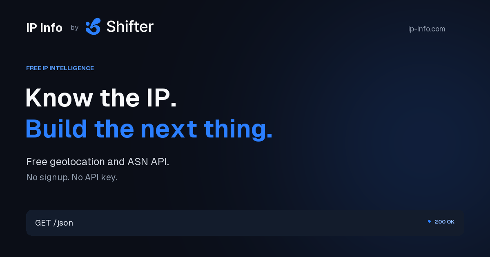

# IP Info by Shifter

Free IP geolocation and ASN intelligence for developers, applications, and AI agents. No signup or API key required. Maintained and supported by [Shifter](https://shifter.io).

This repository contains the Rust service and standalone website for **ip-info.com**. One optimized binary serves both the API and the website, using a shared, memory-mapped IP database.



## Features

- IPv4 and IPv6 lookups: caller IP, query parameter, or path parameter.
- 29 JSON fields covering country, region, city, coordinates, timezone, ISP, organization, and ASN. Unavailable values are `null`.
- Public GET CORS, structured errors, and `Cache-Control: no-store` on lookups.
- Dark Shifter-branded website, API examples in nine languages, and page-specific social images.
- OpenAPI 3.1, `llms.txt`, `llms-full.txt`, and an AI integration guide.
- Optional consent-gated GA4; disabled unless a measurement ID is configured.
- Non-root Docker image, readiness/liveness endpoints, graceful shutdown, and explicit trusted-proxy configuration.

## Local setup

Requires Rust 1.88+ or Docker. Python 3 is needed only to regenerate website assets. Node.js is used for browser tests, not by the service.

1. Obtain the licensed Location + ISP MMDB through the authorized internal distribution channel and place it at `data/dbip.mmdb`. The database is intentionally excluded from Git.
2. Confirm its SHA-256 matches `data/source-manifest.json`. The Docker build verifies this checksum automatically.
3. Start the service:

```sh
cargo run --release --locked
```

Open **http://127.0.0.1:8080**. The local homepage displays `8.8.8.8` as a preview; this fallback does not change the API's public-IP validation.

Alternatively:

```sh
docker compose up --build -d
curl --fail http://127.0.0.1:8080/readyz
```

The service still serves its website if the database is unavailable, but readiness and valid-IP lookups return HTTP 503.

## API quickstart

```sh
# Caller’s public network exit (use on the deployed service)
curl https://ip-info.com/json

# Explicit IPv4 address
curl 'http://127.0.0.1:8080/json?ip=8.8.8.8'

# Explicit IPv6 address
curl 'http://127.0.0.1:8080/json?ip=2001:4860:4860::8888'

# Equivalent path form
curl http://127.0.0.1:8080/8.8.8.8/json
```

Responses contain the complete schema shown in [`tests/example.json`](tests/example.json). See the [API reference](web/docs.html) and [OpenAPI contract](web/openapi.json) for all fields, examples, and errors.

Only literal public IP addresses are accepted. Invalid, private, reserved, or conflicting targets return 400; absent records return 404; database unavailability returns 503. Geolocation is approximate. `/json` identifies the requesting client or agent's network exit, not necessarily a human user's IP.

HTTP and HTTPS expose the same lookup contract in production. TLS is terminated by the hosting ingress; the Rust process listens on HTTP internally.

## Configuration

See [`.env.example`](.env.example). Native execution reads process environment variables; it does not automatically load a `.env` file.

- `BIND_ADDR`: listener address; defaults to `0.0.0.0:8080`.
- `MMDB_PATH`: database file; defaults to `data/dbip.mmdb` (the image uses `/data/dbip.mmdb`).
- `TRUSTED_PROXY_CIDRS`: comma-separated verified ingress networks. Empty by default; forwarded headers from untrusted peers are ignored. Never configure a trust-all range.
- `CLIENT_IP_HEADER`: defaults to `x-forwarded-for`. Configure only after verifying ingress header handling.
- `GA4_MEASUREMENT_ID`: optional `G-…` ID. Empty disables analytics. Browser collection requires explicit consent.
- `INGRESS_SECRET`: optional 32–128 character alphanumeric secret for authenticated CDN forwarding. Production uses this boundary instead of trusting proxy CIDR ranges; never commit its value.
- `SITE_INDEXABLE`: defaults to `false`; enable only after production launch checks.

## Development

Website sources live in `site/`. The Python generator embeds CSS, JavaScript, fonts, and branding into standalone HTML files. The Rust binary embeds generated files at build time, so rebuild after generation.

```sh
python3 scripts/generate_site.py
python3 scripts/validate_artifacts.py
cargo fmt --check
cargo clippy --locked --all-targets -- -D warnings
cargo test --locked
python3 scripts/smoke.py http://127.0.0.1:8080
```

Database integration checks require the licensed local MMDB. Browser checks are under `tests/browser/` and use Playwright (`npm ci`, then `npm run test:browser`); review test configuration before running against an existing preview.

Social images are generated by `scripts/generate_meta_images.py` with Pillow, fonttools, and brotli. View the [standalone image gallery](docs/meta-images.html).

## Repository layout

- `src/`: Rust server, IP validation, database decoding, and response types.
- `site/`: editable website templates, styles, scripts, and brand assets.
- `scripts/`: API definitions, website/image generators, validation, smoke checks, and benchmarks.
- `web/`: generated website and machine-readable documentation, committed for reproducible builds.
- `tests/`: API and browser checks plus the documented response example.
- `data/source-manifest.json`: database provenance and checksum; no commercial database bytes.
- `docs/`: standalone HTML operations, validation, design, and performance documentation.

## Deployment and database updates

Use the [standalone operations guide](docs/operations.html) for Bunny Magic Containers setup, trusted ingress, HTTP/HTTPS routing, cache prevention, database replacement, and launch checks.

The image includes the licensed database in a separate layer and **must remain in a private registry**. Replace the image and restart when updating the database. Never modify a memory-mapped database file in place. Update the source manifest alongside each authorized replacement.

The service is deployed on Bunny Magic Containers at https://ip-info.com. Daily database automation, GA4 provisioning, and Search Console verification remain follow-up tasks. Local benchmark reports describe their measured environment, not production capacity guarantees.

## License, data and branding

The source code is released under the [MIT License](LICENSE). The commercial database is not included or licensed for redistribution by this repository. Shifter branding and third-party data retain their respective rights.

For service support, contact [hi@shifter.io](mailto:hi@shifter.io).
